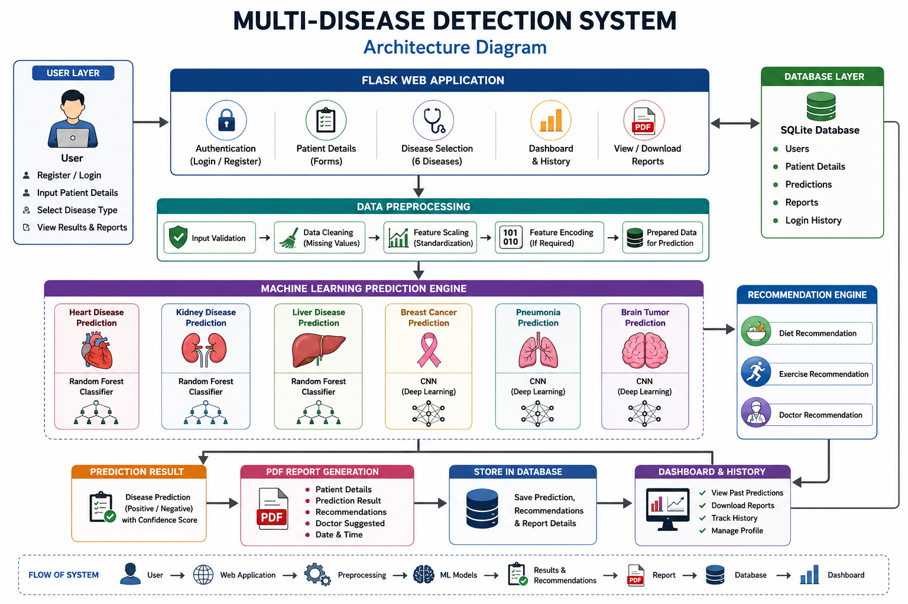

<div align="center">


# 🏥 Multi Disease Detection using Machine Learning

### Intelligent Healthcare Prediction using Machine Learning & Deep Learning


<br>


<br><br>


</div>

---

# 📖 Table of Contents

- 📌 Project Overview
- ✨ Features
- 🏗️ System Architecture
- 🛠️ Technology Stack
- 🤖 Machine Learning Models
- 📂 Project Structure
- 🚀 Installation
- ▶️ Run the Project
- 🔄 Workflow
- 📸 Screenshots
- 🔮 Future Enhancements
- 🤝 Contributing
- 👨‍💻 Author

---

# 📌 Project Overview

The **Multi Disease Detection System** is an AI-powered healthcare web application that predicts multiple diseases using Machine Learning and Deep Learning algorithms.

Users can securely register, enter patient information, choose a disease prediction model, and instantly receive prediction results with personalized health recommendations.

The application also stores prediction history, generates downloadable PDF reports, and provides a user-friendly dashboard for managing previous predictions.

---

# ✨ Features

## 👤 User Module

- Secure Login
- User Registration
- Profile Management

## 🏥 Disease Prediction

- ❤️ Heart Disease
- 🩺 Kidney Disease
- 🫁 Liver Disease
- 🎗️ Breast Cancer
- 🫁 Pneumonia
- 🧠 Brain Tumor

## 📊 Dashboard

- Prediction History
- Download Reports
- Patient Records
- User Dashboard

## 📄 Reports

- PDF Report Generation
- Prediction Summary
- Confidence Score
- Doctor Recommendation

## 💡 Recommendation Engine

- Diet Recommendation
- Exercise Suggestion
- Doctor Recommendation

---

# 🏗️ System Architecture

The **Multi Disease Detection System** follows a layered architecture that integrates authentication, data preprocessing, machine learning/deep learning models, recommendation services, report generation, and database management to provide accurate disease predictions.
---

## 🔄 System Flow

```text
                               👤 User
                                  │
                                  ▼
                      🔐 Login / Register
                                  │
                                  ▼
                     📝 Enter Patient Details
                                  │
                                  ▼
                      🩺 Select Disease Type
                                  │
                                  ▼
                    ✔ Input Data Validation
                                  │
                                  ▼
                       🧹 Data Preprocessing
             (Cleaning • Scaling • Feature Encoding)
                                  │
                                  ▼
                  🤖 Machine Learning Prediction Engine
        ┌──────────────────┬──────────────────┬──────────────────┐
        ▼                  ▼                  ▼
 ❤️ Heart Disease    🩺 Kidney Disease    🫁 Liver Disease
(Random Forest)      (Random Forest)      (Random Forest)

        ▼                  ▼                  ▼

 🎗 Breast Cancer     🫁 Pneumonia        🧠 Brain Tumor
      (CNN)               (CNN)               (CNN)

                                  │
                                  ▼
                     📊 Prediction Result
                                  │
               ┌──────────────────┼──────────────────┐
               ▼                  ▼                  ▼
        📄 PDF Report      💡 Recommendations    💾 Save Result
                               │                      │
              Diet • Exercise • Doctor               │
                               │                      │
                               └──────────┬──────────┘
                                          ▼
                                  🗄 SQLite Database
                                          │
                                          ▼
                              📈 Dashboard & History
                                          │
                                          ▼
                    👤 View Reports • Download PDF • History
```

---

## ⚙️ Workflow

1. 👤 User registers or logs into the application.
2. 📝 Patient details are entered through secure forms.
3. 🩺 The user selects one of the available disease prediction modules.
4. ✔ Input data is validated before processing.
5. 🧹 The data undergoes preprocessing, including cleaning, scaling, and feature encoding.
6. 🤖 The selected Machine Learning or Deep Learning model predicts the disease.
7. 📊 The prediction result and confidence score are displayed.
8. 💡 Personalized diet, exercise, and doctor recommendations are generated.
9. 📄 A downloadable PDF report is created.
10. 💾 Prediction details are stored securely in the SQLite database.
11. 📈 Users can access previous predictions, reports, and history through the dashboard.

# 🛠️ Technology Stack

| Category | Technology |
|-----------|------------|
| Frontend | HTML, CSS, Bootstrap, JavaScript |
| Backend | Python, Flask |
| Machine Learning | Scikit-learn |
| Deep Learning | TensorFlow / Keras |
| Database | SQLite |
| Data Processing | Pandas, NumPy |
| Visualization | Matplotlib |
| Report Generation | ReportLab / FPDF |
| Version Control | Git & GitHub |

---

# 🤖 Machine Learning Models

| Disease | Algorithm |
|----------|-----------|
| ❤️ Heart Disease | Random Forest |
| 🩺 Kidney Disease | Random Forest |
| 🫁 Liver Disease | Random Forest |
| 🎗️ Breast Cancer | CNN |
| 🫁 Pneumonia | CNN |
| 🧠 Brain Tumor | CNN |

---

# 🔄 Prediction Workflow

```text
User
 │
 ▼
Login / Register
 │
 ▼
Enter Patient Details
 │
 ▼
Select Disease
 │
 ▼
Data Validation
 │
 ▼
Data Preprocessing
 │
 ▼
Machine Learning Model
 │
 ▼
Prediction Result
 │
 ├────────► Recommendation Engine
 │
 ├────────► PDF Report
 │
 └────────► Store in SQLite Database
                │
                ▼
       Dashboard & Prediction History
```

---

# 📂 Project Structure

```bash
Multi-Disease-Detection
│
├── static/
├── templates/
├── models/
│   ├── Heart Disease
│   ├── Kidney Disease
│   ├── Liver Disease
│   ├── Breast Cancer
│   ├── Pneumonia
│   └── Brain Tumor
│
├── database/
├── reports/
├── assets/
│   └── architecture.png
│
├── app.py
├── requirements.txt
└── README.md
```

---

# 🚀 Installation

Clone the repository

```bash
git clone https://github.com/Hemanthmahendrakar/Muti-Disease-Detection-using-Machine-Learning.git
```

Go to the project folder

```bash
cd Muti-Disease-Detection-using-Machine-Learning
```

Create virtual environment

```bash
python -m venv venv
```

Activate environment

Windows

```bash
venv\Scripts\activate
```

Linux / macOS

```bash
source venv/bin/activate
```

Install dependencies

```bash
pip install -r requirements.txt
```

---

# ▶️ Run the Application

If Flask

```bash
python app.py
```

If Streamlit

```bash
streamlit run app.py
```

---

# 📸 Screenshots

## 🏗️ System Architecture

<p align="center">



</p>

---


# 🌟 Project Highlights

- ✅ AI Powered Healthcare System
- ✅ Six Disease Prediction Models
- ✅ Machine Learning + Deep Learning
- ✅ Secure Authentication
- ✅ Data Preprocessing Pipeline
- ✅ SQLite Database
- ✅ PDF Report Generation
- ✅ Dashboard & Prediction History
- ✅ Recommendation Engine
- ✅ Clean Flask Architecture

---

# 🔮 Future Enhancements

- 🌐 Cloud Deployment
- 📱 Mobile Responsive UI
- 🤖 AI Chatbot
- 📈 Model Explainability
- 🧬 More Disease Prediction Models
- 📧 Email Reports
- 🔔 Notification System
- 🩺 Doctor Appointment Integration

---

# 🤝 Contributing

Contributions are welcome!

1. Fork this repository

2. Create a feature branch

3. Commit your changes

4. Push the branch

5. Open a Pull Request

---

# ⭐ Support

If you found this project useful, consider giving it a ⭐ on GitHub.

---

<div align="center">

# 👨‍💻 Author

## Hemanth Kumar

### DevOps Engineer • Machine Learning Developer • Cloud Enthusiast

**Made with ❤️ using Python, Flask, Machine Learning & Deep Learning**


</div>
